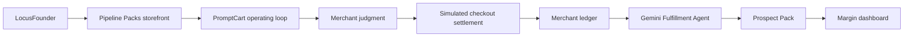

# PromptCart AI

<p align="center">
  <strong>LocusFounder starts the business. PromptCart AI runs it like a merchant.</strong>
</p>

<p align="center">
  <a href="https://promptcart-ai.vercel.app"></a>
  <a href="https://svc-mp5n8uzwxp69yxs2.buildwithlocus.com"></a>
  <a href="https://api.locusfounder.com/api/onboarding/prospect/2c40a15b-3d32-4894-86df-8cd2333eb7ac/plan.pdf"></a>
  
  
</p>

PromptCart AI demonstrates the operating loop for **Pipeline Packs**, a real LocusFounder-created business that sells evidence-backed prospect packs to boutique CRO and growth agencies.

LocusFounder created the business artifact. PromptCart AI shows how that business can operate after launch: merchant judgment, simulated checkout settlement, merchant ledger accounting, AI fulfillment, delivery, and retained margin.

## Submission Snapshot

| Item | Link / Status |
| --- | --- |
| PromptCart AI live app | <https://promptcart-ai.vercel.app> |
| LocusFounder storefront | <https://svc-mp5n8uzwxp69yxs2.buildwithlocus.com> |
| LocusFounder business plan | <https://api.locusfounder.com/api/onboarding/prospect/2c40a15b-3d32-4894-86df-8cd2333eb7ac/plan.pdf> |
| Repository | <https://github.com/luzzwaix/promptcart-ai> |
| Track fit | LocusFounder-created business plus merchant operating loop |
| AI proof | Live Gemini Fulfillment Agent when configured |
| Payment status | Simulated checkout and wallet settlement |

## Proof Stack

PromptCart AI is explicit about what is verified, what is simulated, and what is not claimed.

| Layer | Status | Evidence |
| --- | --- | --- |
| LocusFounder business creation | Verified | Pipeline Packs storefront and business plan |
| LocusFounder storefront deployment | Verified | Live Build with Locus URL |
| LocusFounder business plan PDF | Verified | Public `LOCUS FOUNDER` plan artifact |
| Locus platform credit spend | Verified | Build/deploy iteration debits in workspace history |
| Gemini Fulfillment Agent | Live when configured | Server-side Gemini call with model fallback |
| Checkout settlement | Simulated | Clearly labeled mock flow |
| Merchant wallet settlement | Simulated | Implemented merchant ledger model |
| Real payment / customer revenue | Not claimed | No processed real payment claimed |

Stripe Connect is unavailable in Kazakhstan. Locus staff confirmed that a clearly labeled mock checkout is acceptable for Week 4 submissions when no real payment is claimed.

## What The Demo Proves

Pipeline Packs sells finished prospect-intelligence assets, not raw databases. The LocusFounder storefront generated three commercial SKUs:

| SKU | Price | Role |
| --- | ---: | --- |
| Starter | `$29` | Small test pack |
| Growth | `$99` | Canonical demo order |
| Scale | `$299` | Higher-volume pack |

PromptCart uses the same pricing in the operating loop. The canonical demo uses the `Growth Pack`.

## Demo Path

1. Start with LocusFounder proof: live storefront, business plan, and platform credit spend.
2. Open PromptCart AI and review the `One business, two layers` judge brief.
3. Confirm the SKUs are synced with the LocusFounder storefront.
4. Select the `Growth Pack`.
5. Edit or keep the buyer request:

   ```text
   Find Shopify brands with checkout friction for a CRO agency targeting DTC apparel.
   ```

6. Review merchant judgment:
   - quoted price
   - estimated automated production spend
   - margin floor
   - accept/reprice/reject logic
7. Trigger the clearly labeled simulated checkout settlement.
8. Watch the fulfillment pipeline run.
9. Inspect the Gemini Fulfillment Agent decision, selected accounts, quality gate, and operator note.
10. Review the delivered Prospect Pack and CSV export.
11. End on the margin dashboard and next-SKU continuity state.

## Canonical Economics

The canonical order demonstrates merchant ledger math for the `Growth Pack`:

| Metric | Value |
| --- | ---: |
| Starting wallet | `$42.00` |
| Simulated payment inflow | `+$99.00` |
| Automated production-layer spend | `-$6.70` |
| Ending wallet | `$134.30` |
| Gross margin | `~93%` |

`$6.70` represents the automated production layer in the PromptCart demo. The LocusFounder storefront also models broader full-service fulfillment overhead.

## Gemini Fulfillment Agent

PromptCart includes one live AI fulfillment step when environment variables are configured.

The agent receives:

- buyer request
- business and SKU context
- representative lead data
- founder prompt
- order economics

It returns:

- `SHIP_PACK` or `NEEDS_REVIEW`
- selected accounts
- pack summary
- quality gate
- fit-score rationale
- outreach opener
- operator note

Reliability path:

1. Try `gemini-2.5-flash-lite`.
2. If it fails, try `gemini-2.5-flash`.
3. If both fail, use deterministic fallback output so the demo remains stable.

The API key is server-side only and is never exposed to the client.

## Architecture



Key files:

| File | Purpose |
| --- | --- |
| `src/components/promptcart-app.tsx` | Main operating-loop UI |
| `src/components/merchant-loop-scene.tsx` | Three.js merchant-loop visual |
| `src/lib/business-engine.ts` | Pricing, profitability, fulfillment, and ledger logic |
| `src/lib/locus-adapters.ts` | Simulated checkout and wallet rails |
| `src/lib/types.ts` | Domain model |
| `src/app/api/locus/synthesize/route.ts` | Gemini Fulfillment Agent route |

Core domain concepts include `BusinessBlueprint`, `SKU`, `Order`, `ProfitabilityAssessment`, `FulfillmentJob`, `SpendEvent`, `ProspectLead`, `DeliverablePack`, `LocusCheckoutGateway`, and `LocusWalletClient`.

The app persists demo state with a versioned local-storage envelope so the judging flow remains replayable.

## What We Do Not Claim

PromptCart AI does **not** claim:

- processed real payments
- live Locus Checkout settlement
- live Locus wallet settlement
- real customer revenue
- production-ready autonomous commerce
- real-time prospect scraping

The checkout and wallet rails are simulated, but shaped around the same sequence a live integration would need:

1. merchant profitability decision
2. checkout session
3. paid callback
4. merchant ledger credit
5. fulfillment budget reserve
6. AI production spend
7. margin settlement

## Run Locally

```bash
npm install
npm run dev
```

Optional live Gemini fulfillment:

```bash
GEMINI_API_KEY=your_key
ENABLE_LIVE_GEMINI_SYNTHESIS=true
```

Verification:

```bash
npm run lint
npm run build
```

## Judge Takeaway

PromptCart AI is a clear operating-loop prototype for a real LocusFounder-created business: a merchant that evaluates unit economics, accepts profitable demand, routes settlement through simulated rails, uses a live Gemini Fulfillment Agent, delivers a paid digital asset, and shows retained margin.
